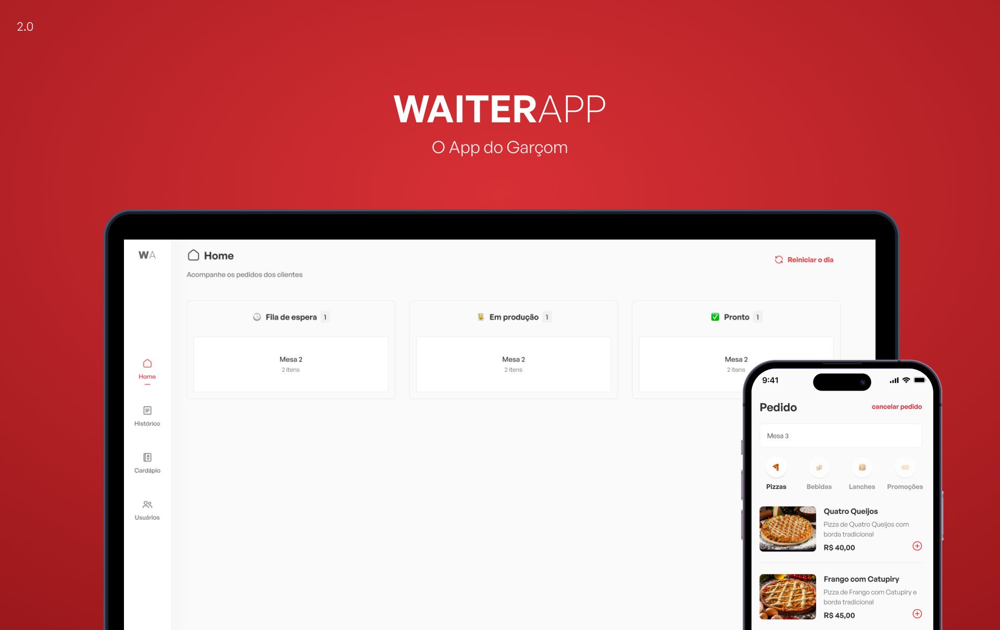

# WaiterApp (**in development**)
An app for the waiter with NodeJs, ReactJs and Flutter, build in 'the power of Js' event

## Features

- ⚛️ **React JS** — A JavaScript library for building user interfaces
- 🚀 **Node JS** — A JavaScript runtime for building backend applications
- 🐘 **PostgreSQL** — An open-source object-relational database
- 🔓 **JWT** - A compact URL-safe means of representing claims to be transferred between two parties.

## Getting started

1. Clone this repo using `git clone git@github.com:vinisoaresr/waiter-app.git`
2. Move yourself to the appropriate directory: `cd waiter-app`
 
### Getting started with the backend server

1. Move yourself to the backend folder: `cd backend`
2. Create a custom `.env` file and add `...todo` 
3. Generate SSL keys according `generateKey.md` on `/backend` folder and move to `...todo`
3. Run `npm install` to install dependencies
3. Run `npm run dev` to start the server

### Getting started with the frontend app

1. Move yourself to the frontend folder: `cd frontend`
2. Create a `.env` file and add key `...todo` 
3. Run `npm install` to install dependencies
2. Run `npm run dev` to start the web application

### Getting started with the mobile app

1. Move yourself to the frontend folder: `cd mobile`
2. Create a `.env` file and add key `...todo` 
3. Run `flutter install` to install dependencies
2. Run `flutter run` to start the web application

## TODO:

- [ ] Tests (100% coverage)

## License

This project is licensed under the MIT License - see the [LICENSE](https://opensource.org/licenses/MIT) page for details.

  

